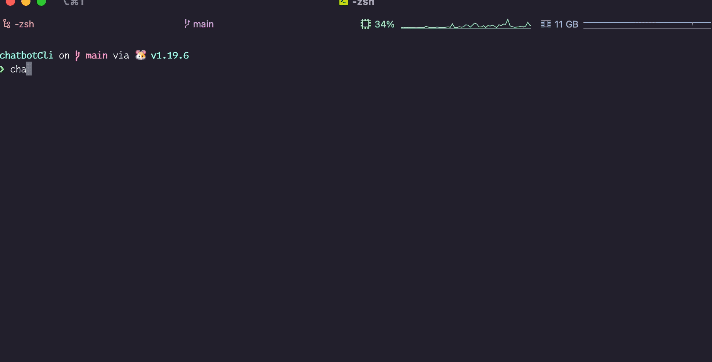
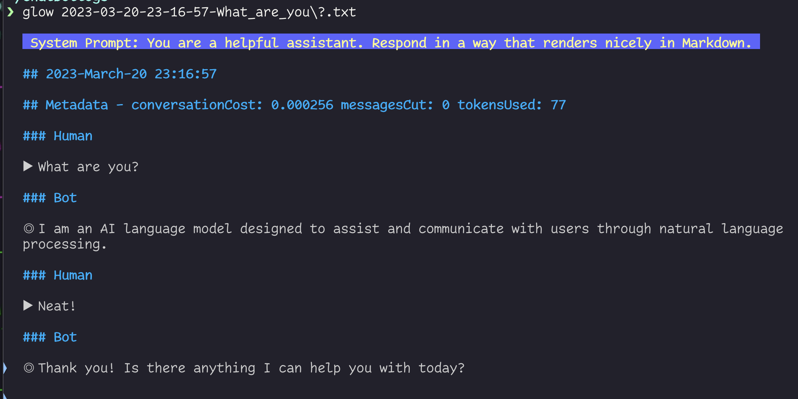

# chatbotCli
Interface to chat GPT using Bubbletea

A chance to play with [BubbleTea](https://github.com/charmbracelet/bubbletea), [Golang](https://go.dev/), and [ChatGPT](https://openai.com/blog/chatgpt)

Requires the following environment variable to be set:

`OPENAI_API_KEY` This is so it can talk to the OPENAI API

You can also set `CHATBOT_LOGS` this is where chat logs will save.

The program will will be a conversation between you and chatgpt. You can customize the prompt by passing in the -prompt flag

```bash
chatbotCli -prompt "You are the coolest bot in the world"
```


Quit at any time with `ctrl-c`. Your chat will be saved as a markdown file in either the current directory or the directory specified by `CHATBOT_LOGS`

